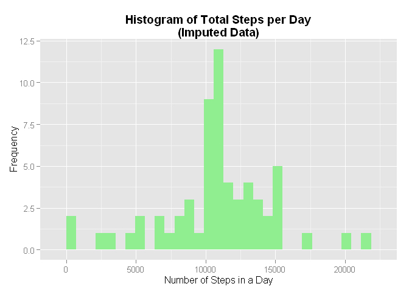
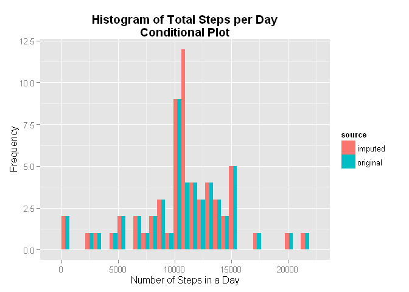
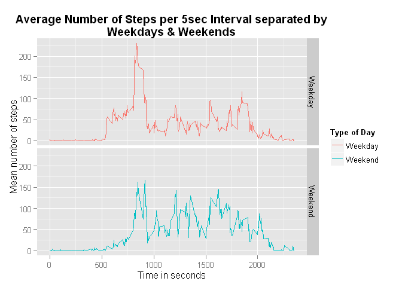

# Reproducible Research: Peer Assessment 1
Rich Robinson  


## Loading and preprocessing the data

```r
data_file <- "activity.csv"
zip_file <- "activity.zip"
zip_url <- "https://d396qusza40orc.cloudfront.net/repdata%2Fdata%2Factivity.zip"

## Checking to see if required files are present
if (!file.exists(data_file)){
  
  if (!file.exists(zip_file)){
    download.file(zip_url, destfile = zip_file)
  }  
  unzip(zip_file)
}

act_data <- read.csv(data_file, header = TRUE, stringsAsFactors = FALSE)
```


## What is mean total number of steps taken per day?

```r
library(dplyr)

res <- act_data %>% group_by(date) %>% summarise(total.steps=sum(steps))

avgs <- res %>% summarise(mean.steps=mean(total.steps, na.rm=TRUE), median.steps=median(total.steps, na.rm=TRUE))
```

```r
library(ggplot2)

base <- ggplot(res, aes(total.steps)) + geom_bar(fill="steelblue")
g <- base + labs(title = "Histogram of Total Steps per Day") + xlab("Number of Steps in a Day") + ylab("Frequency")
g <- g + theme(plot.title = element_text(face="bold"))

print(g)
```

 

The histogram above shows that the most common number of steps taken in an individual day is just above 10000.

The mean number of steps per day is 1.076619\times 10^{4}, and the median number of steps per day is 10765.


## What is the average daily activity pattern?

```r
## Calculating the mean steps per intrval
ints <- act_data %>% group_by(interval) %>% summarise(mean.steps=mean(steps, na.rm=TRUE))

## Plotting
g2 <- ggplot(ints, aes(interval, mean.steps)) + geom_line(color="steelblue", size=1)
g2 <- g2 + labs(title="Average Number of Steps Across all Days per 5sec Interval") + theme(plot.title = element_text(face="bold"))
g2 <- g2 + xlab("Time in seconds") + ylab("Mean number of steps")

## Sorting the data in descending order by steps
ints2 <- ints %>% arrange(desc(mean.steps))

print(g2)
```

 

The grpah above shows how the average number of steps in a 5 second interval varies across a day. The values in each intervale were averaged across all days in the sample.

The interval with the highest average number of steps is intervale number 167, which is at 835 seconds. The mean number of steps measured in this interval is 206.17.

## Imputing missing values

```r
## Counting the number of missing values
num_na <- sum(is.na(act_data$steps))
```

The number of missing values in the data set is 2304.

To replace (impute) the missing values in the data set, the mean number of steps for the corresponding 5 second interval will be used.


```r
## interval means have been calculated earlier (ints variable)

## Joining the interval means into the activity data set
tmp_jn <- left_join(act_data, ints, by="interval")

imp_data <- tmp_jn %>% mutate(steps = ifelse(is.na(steps), round(mean.steps, digits=0), steps))

## Imputed total steps by day
imp_tot <- imp_data %>% group_by(date) %>% summarise(total.steps = sum(steps))

imp_avg <- imp_tot %>% summarise(mean.steps=mean(total.steps), median.steps=median(total.steps))

## Plotting a histogram of the imputed data
g3 <- ggplot(imp_tot, aes(total.steps)) + geom_bar(fill="lightgreen")
g3 <- g3 + labs(title = "Histogram of Total Steps per Day\n(Imputed Data)") + xlab("Number of Steps in a Day") + ylab("Frequency")
g3 <- g3 + theme(plot.title = element_text(face="bold"))

max_steps <- imp_tot %>% arrange(desc(total.steps))

print(g3)
```

 

With the imputed data, the maximum number of steps taken in a individual day is 2.1194\times 10^{4} steps on 2012-11-23.


```r
library(knitr)

comp <- bind_cols(avgs, imp_avg)
names(comp) <- c("Original.Mean", "Original.Median", "Imputed.Mean", "Imputed.Median")

kable(comp, format="html")
```

<table>
 <thead>
  <tr>
   <th style="text-align:right;"> Original.Mean </th>
   <th style="text-align:right;"> Original.Median </th>
   <th style="text-align:right;"> Imputed.Mean </th>
   <th style="text-align:right;"> Imputed.Median </th>
  </tr>
 </thead>
<tbody>
  <tr>
   <td style="text-align:right;"> 10766.19 </td>
   <td style="text-align:right;"> 10765 </td>
   <td style="text-align:right;"> 10765.64 </td>
   <td style="text-align:right;"> 10762 </td>
  </tr>
</tbody>
</table>


The above table shows the mean and median values for both the original data and the imputed data. It can be seen that the imputed data has caused a small reduction in both the mean and median number of steps. This makes sense because any missing values were completely excluded from the previous analysis. By replacing the missing values with the averages it has skewed the data and in this case towards the lower end of the range as hte majority of the values are above the averages.


```r
## Combining the original and imputed data in order to make a conditional historgram

con1 <- mutate(res, source = "original")
con2 <- mutate(imp_tot, source = "imputed")
con3 <- bind_rows(con1, con2)

## Creating the conditional plot
g4 <- ggplot(con3, aes(total.steps)) + geom_bar(aes(fill=source), position = "dodge")
g4 <- g4 + labs(title = "Histogram of Total Steps per Day\nConditional Plot") + xlab("Number of Steps in a Day") + ylab("Frequency")
g4 <- g4 + theme(plot.title = element_text(face="bold"))

print(g4)
```

 

The above conditional plot shows how the frequency of ranges of steps within a day has changed. There were a total of 8 days within the original data set with missing values. Since these have been replaced with the mean interval values, it is not surprising that the **"bin"** in the middle of the histogram, which contains the mean value, has increased accordingly.


## Are there differences in activity patterns between weekdays and weekends?


```r
## Using the imputed data set created above

## Converting to date class from strings
imp_data2 <- imp_data %>% mutate(date = as.Date(date, format = "%Y-%m-%d"))

## Specifying the type of day
imp_data2 <- imp_data2 %>% mutate(day.type = ifelse(weekdays(date) == "Saturday" | weekdays(date) == "Sunday", "Weekend", "Weekday"))

## Converting the day.type to a factor from a string
lvls = c("Weekday", "Weekend")

imp_data2 <- imp_data2 %>% mutate(day.type = factor(day.type, levels = lvls))

## Creating the conditional plot
## Calculating the mean steps by interval for weekdays and weekends
imp_ints <- imp_data2 %>% group_by(interval, day.type) %>% summarise(mean.steps = mean(steps))

## Plotting
g5 <- ggplot(imp_ints, aes(interval, mean.steps)) + geom_line(aes(color=day.type)) + facet_grid(day.type ~ .)
g5 <- g5 + labs(title="Average Number of Steps per 5sec Interval separated by\nWeekdays & Weekends") + theme(plot.title = element_text(face="bold"))
g5 <- g5 + xlab("Time in seconds") + ylab("Mean number of steps")
## To change the ledgend title to something more useful
g5 <- g5 + scale_color_discrete(name="Type of Day") 

print(g5)
```

 

End of data analysis.
