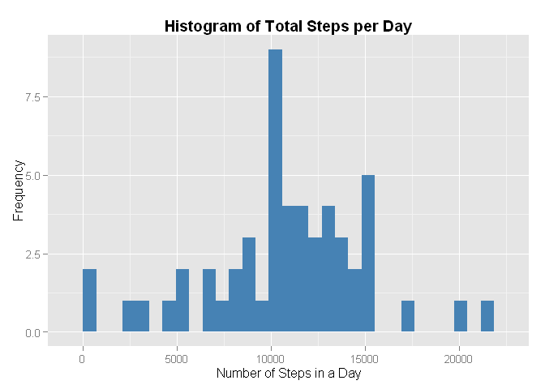
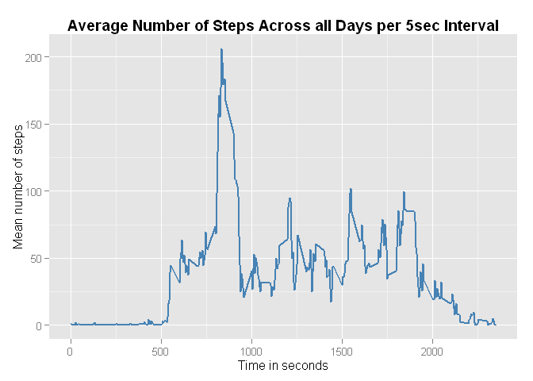

# Reproducible Research: Peer Assessment 1
Rich Robinson  


## Loading and preprocessing the data

```r
data_file <- "activity.csv"
zip_file <- "activity.zip"
zip_url <- "https://d396qusza40orc.cloudfront.net/repdata%2Fdata%2Factivity.zip"

## Checking to see if required files are present
if (!file.exists(data_file)){
  
  if (!file.exists(zip_file)){
    download.file(zip_url, destfile = zip_file)
  }  
  unzip(zip_file)
}

act_data <- read.csv(data_file, header = TRUE, stringsAsFactors = FALSE)
```


## What is mean total number of steps taken per day?

```r
library(dplyr)

res <- act_data %>% group_by(date) %>% summarise(total.steps=sum(steps))

avgs <- res %>% summarise(mean.steps=mean(total.steps, na.rm=TRUE), median.steps=median(total.steps, na.rm=TRUE))
```

```r
library(ggplot2)

base <- ggplot(res, aes(total.steps)) + geom_bar(fill="steelblue")
g <- base + labs(title = "Histogram of Total Steps per Day") + xlab("Number of Steps in a Day") + ylab("Frequency")
g <- g + theme(plot.title = element_text(face="bold"))

print(g)
```

 

The histogram above shows that the most common number of steps taken in an individual day is just above 10000.

The mean number of steps per day is 1.0766189\times 10^{4}, and the median number of steps per day is 10765.


## What is the average daily activity pattern?

```r
## Calculating the mean steps per intrval
ints <- act_data %>% group_by(interval) %>% summarise(mean.steps=mean(steps, na.rm=TRUE))

## Plotting
g2 <- ggplot(ints, aes(interval, mean.steps)) + geom_line(color="steelblue", size=1)
g2 <- g2 + labs(title="Average Number of Steps Across all Days per 5sec Interval") + theme(plot.title = element_text(face="bold"))
g2 <- g2 + xlab("Time in seconds") + ylab("Mean number of steps")

## Sorting the data in descending order by steps
ints2 <- ints %>% arrange(desc(mean.steps))

print(g2)
```

 

The grpah above shows how the average number of steps in a 5 second interval varies across a day. The values in each intervale were averaged across all days in the sample.

The interval with the highest average number of steps is intervale number 167, which is at 835 seconds. The mean number of steps measured in this interval is 206.1698113.

## Imputing missing values


## Are there differences in activity patterns between weekdays and weekends?
